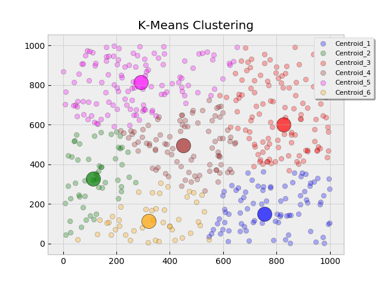
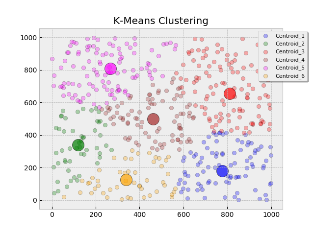

# K-Means Clustering


Coding Popular Machine Learning Algorithms from Scratch

## Algorithms
* [K-Means Clustering](https://github.com/Jadams29/ML_From_Scratch/tree/master/K-Means_Clustering)


Generate K centroids and randomly place on the grid. Iterate over all nodes and assign them to one 
of the centroid based on which is closest to that node. Once all node have been assigned to a centroid, for each
centroid calculate the mean of its assigned nodes. Move the centroid to the mean location. Iterate over the nodes
again and assign them to the closest centroid, repeat until the centroids stop moving location.

(If a centroid does not have nodes assigned to it for an iteration, the centroid should be moved to some random
location. All nodes should be reassigned to the centroids, if situation occurs repeat these steps) 
 
 To determine an optimal number of centroids (K) you can use the elbow method. (DESCRIBE ELBOW METHOD)
## Setup
* Install libraries
```commandline
pip install -r requirements.txt
```
## Steps
* Generate K Centroids and randomly assign them locations 
```python
Centroids = Create_K_Centroids(k, k_centroids=np.random.randint(0, 1000, size=(2, k)), colors=color_list)
```


* Iterate over the nodes and assign them to the centroid which is closest based on euclidean distance. Set the color 
of each node based on the centroid in which it belongs.

```python
def distance1(x1, y1, x2, y2):
    # sqrt( (X1-X2)^2 + (Y1-Y2)^2 )
    return math.sqrt(math.pow((x1 - x2), 2) + math.pow((y1 - y2), 2))
```


* For each Centroid calculate the mean of the nodes that are assigned to it. Move the centroid to that calculated mean.



* Re-Distribute the nodes to the centroid which is determined to be closest based on euclidean distance. Update colors 
for nodes which change association. 



* Repeat until the Centroids no longer move.


* If a centroid does not get any nodes assigned to it, randomly generate a new location for that centroid. 
then re-distribute the nodes.


