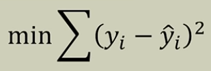
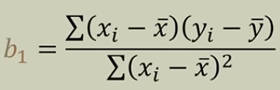
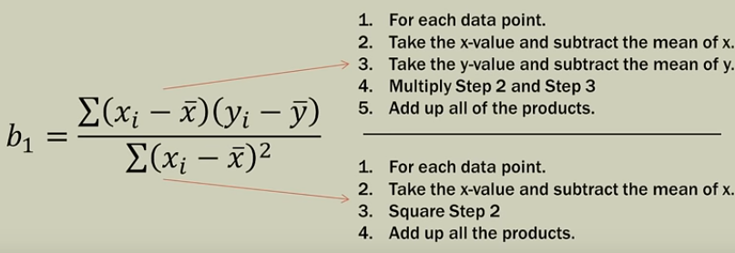
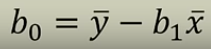

# Linear Regression

Coding Popular Machine Learning Algorithms from Scratch

## Algorithms

* [Linear Regression](https://github.com/Jadams29/ML_From_Scratch/tree/master/Linear_Regression)


#### Least Squares



minimize the sumation of (actual_y - predicted_y)^2
```python
# Not actual code
min(sum([(actual_y - predicted_y)^2]))
```

#### Deviation

```python
# Not actual code
x_deviation = (x - x_mean)
y_deviation = (y - y_mean)
```

#### Deviation Product

```python
# Not actual code
(x_deviation)(y_deviation)
```

#### Expanded Slope





```python

```

#### Y Intercept




